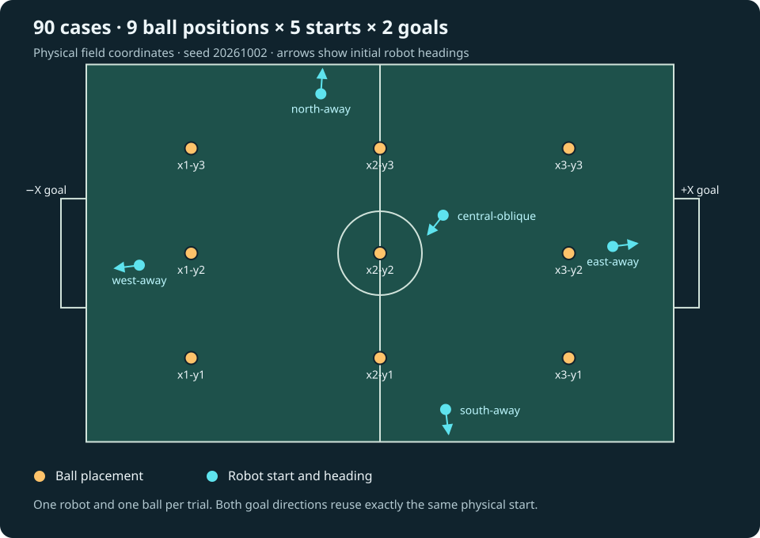

# K1 approach, kick and score benchmarks

This fixture exercises the current match runner, navigation and `SingleShot`
through the new world model and the simulated K1's native motion controller.
It records every case, then independently evaluates contact and scoring from
raw simulator truth. The videos replay actual recorded MuJoCo joint and body
states, including unsuccessful attempts. They do not animate planned paths or
advance a second simulation.

These are ground-truth benchmarks. They do not use camera perception or test a
physical robot. The original six-case smoke run, the harder six-case preflight
and all 90 grid cases have been executed. The grid completed 86 shot sequences,
with 30 goals and four retained execution/setup failures; see the results below.

## Full grid: 90 cases

The ball positions form a 3 × 3 grid in physical simulator coordinates:

| Y / X (metres) | −4.5 | 0 | +4.5 |
| --- | --- | --- | --- |
| +2.5 | x1-y3 | x2-y3 | x3-y3 |
| 0 | x1-y2 | x2-y2 | x3-y2 |
| −2.5 | x1-y1 | x2-y1 | x3-y1 |

Each ball position is paired with all five robot starts and both goals at
(−7, 0) and (+7, 0). This gives 9 × 5 × 2 = **90 trials**. The physical ball,
robot position and initial heading are identical when testing the other goal.
Only the selected goal and the input mapping to team coordinates change.

The five starts use seed **20261002**. They are randomly sampled inside five
small, deliberately chosen regions, so they are reproducible and cover the
approach difficulties we want to test. They are not five unrestricted random
draws. Headings are measured anticlockwise from physical +X.

| Start | X (m) | Y (m) | Heading | What it tests |
| --- | --- | --- | --- | --- |
| west-away | −5.736 | −0.287 | 187.1° | Starts west of every ball, facing away; wrong side for the −X goal |
| east-away | +5.548 | +0.160 | 7.1° | Starts east of every ball, facing away; wrong side for the +X goal |
| north-away | −1.410 | +3.800 | 86.1° | Near the north touchline, initially facing outwards |
| south-away | +1.565 | −3.727 | −83.2° | Near the south touchline, initially facing outwards |
| central-oblique | +1.505 | +0.905 | −128.5° | Central, off-axis approaches, including a short approach to the centre ball |



Every ball/goal pairing includes starts on both sides of the ball along the
shooting direction, four starts facing away from the ball, and the two
touchline starts. The runner checks at least 1 m initial robot–ball separation
and 0.6 m centre clearance from field edges. These are setup checks, not a
claim that every route or shot will succeed.

All trials retain fixed power **1.5**. The previous pilot measured about 4.6 m
ball displacement at this power; some grid shots will therefore fall short.
The baseline measures approaching and executing a single shot from the given
position. It does not carry the ball into range, select power by distance or
retry shots. Approaching the ball, completing a shot and scoring are separate
results. Subsequent behaviour changes can be compared against this baseline.

## Preflight and execution budgets

Run `--suite preflight` before the full grid. It selects these six exact grid
cases, with the same placements, settings and time budgets:

- `x2-y2-east-away-positive` and `x2-y2-west-away-negative`: central ball,
  robot on the goal side of the ball and initially facing away.
- `x3-y3-north-away-positive` and `x1-y1-south-away-negative`: touchline starts
  facing outwards, approaching an off-centre ball.
- `x3-y2-west-away-positive` and `x1-y2-east-away-negative`: long approaches
  from the far side of the field, initially facing away.

The grid/preflight wall-time limit for each trial is
`max(45, ceil((1.5 × start-to-ball distance + 2 m) / 0.2 m/s + 25 s))`.
The extra distance allows for circling and slower tracking; the final allowance
covers turning, referee release, the bounded kick activation and stopping.
This gives **45–115 seconds** for the default grid, followed by eight seconds
of passive observation. The total of these upper bounds is about 127 minutes,
excluding setup and offline rendering; successful trials can finish earlier.
The original smoke suite retains its 45-second limit.

Command, observation, world-snapshot and SDK freshness limits are unchanged.
Kick activation remains limited to eight seconds and stop confirmation to two
seconds. `--timeout` can explicitly override the execution budget with a value
from 10 to 180 seconds; the chosen value is frozen in the manifest.

## Freeze a plan, execute, and resume

Planning does not connect to ROS or the simulator. From the repository root,
using Python 3.11+ with the world-model package installed:

```sh
PYTHONPATH=src/behaviour/scripts python src/behaviour/examples/booster_match/run_score_benchmark.py \
  --suite grid --seed 20261002 --plan-only --output ../runswift-artifacts/score-grid-plan
```

This writes all 90 cases, their exact headings, per-case budgets and fixture
source hashes to `manifest.json`. `summary.json` and `totals.json` initially
list them all as not started. No trial directories or motion are created.
`--suite grid` is the default for a new run. `--suite smoke` selects the original
six cases described below; `--case NAME` can select a subset of a chosen suite.

In the prepared marvin environment from the [live guide](README.md), after
syncing the current source and starting the dedicated simulator:

```sh
ros-venv/bin/python behaviour/examples/booster_match/run_score_benchmark.py \
  --suite preflight --output score-grid-preflight
# Inspect the preflight results before starting the full grid.
ros-venv/bin/python behaviour/examples/booster_match/run_score_benchmark.py \
  --suite grid --output score-grid-results
```

To execute an already frozen plan, or continue a stopped run, use the same
output directory with `--resume`. The runner restores the original settings:

```sh
ros-venv/bin/python behaviour/examples/booster_match/run_score_benchmark.py \
  --output score-grid-results --resume
```

Only cases whose directories do not yet exist will run. Completed trials,
failed trials and attempts interrupted before writing a final summary are
never retried or overwritten. An interrupted attempt remains `interrupted`,
with an unknown outcome; a later deliberate repeat needs a new run directory.
The runner rejects changed cases, budgets, seed or fixture source on resume.
An operating-system lock prevents concurrent writers to the same run.
Continue to use only one motion fixture at a time, even with different output
directories. Version 1 recordings remain evaluable/renderable but cannot be
resumed with this mechanism.

Checkpoints include every planned case, so failures cannot disappear from the
denominator. The independent evaluator also accepts partially completed runs.
It separates reaching the behaviour's kick window (`kick_requested`), shot
completion, confirmed stopping, measured contact, goal-line offset, ball
displacement and scoring. A kick request is a behaviour-stage diagnostic,
not independent proof that the approach was well aligned.

Video now uses a fixed full-field view with the same physical orientation for
both goals. All cases appear in manifest order. If a case never started, was
interrupted without a complete recording, or has unusable footage, its place
is a labelled three-second card explaining the missing evidence. Other cases
continue to render. Cards never represent simulated motion or scored misses.

Setup validation on 2 October 2026: 150 benchmark and match/shot regression
tests passed on each of Python 3.11 and 3.14. The independent evaluator still
reproduced the original six goals from their unchanged recordings. The wider
camera and an unavailable-footage card were rendered and inspected using an
existing recording, with the simulator stopped. This validates the preparation,
not the performance of the new grid cases.

## Original smoke cases

The three layouts below are in physical simulator metres, facing the +X goal
at (7, 0). Each is also rotated 180 degrees around the field centre to face the
-X goal at (-7, 0), giving six cases in a fixed order.

| Case | Ball XY | Robot start XY | Initial yaw | Power |
| --- | --- | --- | --- | --- |
| Centre | (4.0, 0.0) | (2.2, -0.5) | 0.2 rad | 1.5 |
| Left | (4.0, 0.6) | (2.4, 1.4) | -0.3 rad | 1.5 |
| Right | (3.5, -0.6) | (1.9, -1.4) | 0.3 rad | 1.5 |

Every start is more than 1.5 m from the ball, outside the initial kick window.
Power is a vendor controller parameter, not a calibrated distance. There is
one attempt per case, with no retries after release. The default execution
limit is 45 seconds, followed by eight seconds of passive observation. The
controller's activation remains bounded by eight seconds and stop confirmation
by two seconds. Robot2 is parked outside the field at (-6, 6), solely to enable
named SDK channels. Robots and ball are positioned only during setup.

For the negative-goal cases, `BenchmarkInputs` rotates the complete captured
scene into team-field coordinates, where the opponent goal remains at +X.
The oracle's odometry axes use the same rotation. Robot headings, ball and
obstacle positions transform together; heights, timestamps and body-relative
geometry are preserved. Each trial has fresh world and motion epochs. The
motion command remains body-relative. The evaluator and video retain the
original physical coordinates and the chosen physical goal direction.

There is no world-model or match-tactics fork for the benchmark. The fixture
uses the reviewed K1 heading/bearing allowance of 0.6 rad and an explicit
`allow_unknown` navigation policy capped at 0.2 m/s. It does not claim that
empty obstacle memory proves observed clear space. Referee permissions are
scripted and clearly labelled. All normal input, snapshot, command and SDK
freshness checks remain enabled.

## Independent evaluation

A separate read-only WebSocket recorder subscribes to `game_control_world` and
`physics_state`. Neither its contact data nor its scoring results feed the
behaviour or world-model input path. The behaviour still uses its own input
bridge and one immutable context per decision.

`score_evaluator.py` needs only Python's standard library. It reads recorded
truth directly, checks original file hashes and reports:

- **Goal:** the whole ball passes the selected goal line within the physical
  opening. With the pinned scene's 0.11 m ball radius, the centre must cross
  X = +/-7.11 m. Its centre must also be inside Y = +/-1.14 m and below 1.64 m,
  accounting for post and crossbar thickness. These are this benchmark's
  geometric checks, not a complete referee rule implementation.
- **Miss or own goal:** the first field-boundary crossing is latched. A ball
  that rebounds from the net still counts as a goal. A ball that first leaves
  through a touchline cannot later count as a goal in the same trial.
- **Short or wide:** without a boundary crossing, the ball must have settled
  below 0.05 m/s for at least 1.8 seconds of progressing samples.
- **Unknown:** gaps over 100 ms, non-progressing time, malformed ball positions
  or incomplete recording intervals cannot prove a goal or a miss. A ball still
  travelling at the end is unresolved.
- **Contact:** the simulator accumulates robot–ball contacts between truth
  publications. This establishes contact with robot1, but does not identify a
  foot, count impulses or establish exactly one strike. Contact-bearing windows
  and separated episodes are reported with those limitations.

Crossing time, Y and Z are linearly interpolated between adjacent truth samples;
this is a sampled estimate, not a physics-step event timestamp. Goal geometry
is checked against the pinned render assets before video generation. The
report also records body heading error at the first kick request, elapsed time,
snapshot age and command gaps. Heading uses the most recently received raw
truth sample, so it is a diagnostic rather than synchronised sensor evidence.

A successful benchmark case needs independent goal and contact evidence, one
controller activation, the completed shot lifecycle, a fresh stopped controller
and valid recording. Execution failure and a ball crossing the goal line are
reported separately. A miss is a valid measured result; an incomplete execution
or unknown outcome is not silently counted as a miss.

## Run and reproduce

Use the isolated marvin workspace from the [live guide](README.md). Sync the
current `behaviour/` and `world_model/` first. Run only one motion fixture at a
time. The benchmark waits up to 30 seconds for a read-only startup connection;
it does not retry a released-robot trial.

```sh
cd /home/oliver/runswift-simulation/booster-1.10.5
bash behaviour/examples/booster_match/start-simulator.sh
source /opt/ros/jazzy/setup.bash
export ROS_DOMAIN_ID=87 ROS_AUTOMATIC_DISCOVERY_RANGE=LOCALHOST
export JAX_PLATFORMS=cpu
export PYTHONPATH="$PWD/world_model:$PWD/behaviour/scripts${PYTHONPATH:+:$PYTHONPATH}"
ros-venv/bin/python behaviour/examples/booster_match/run_score_benchmark.py \
  --suite smoke --output score-results
docker stop runswift-world-model-sim
```

The start script expects the dedicated container to be stopped. Use a new output
directory each time. `--case centre-positive` selects a single case; repeat the
flag to select several. Setup failures and unsuccessful attempts stay in the
results. The runner exits unsuccessfully if any execution or evaluation is
incomplete; it does not require every valid shot to score.

Recompute the evaluation separately, without ROS, MuJoCo or the SDK:

```sh
python3 behaviour/examples/booster_match/score_evaluator.py \
  --run score-results --output score-results/evaluation.json
```

Render after motion has stopped. The prepared host environment has MuJoCo,
OpenCV, EGL and FFmpeg; the standalone world-model package does not require them.

```sh
ros-venv/bin/python behaviour/examples/booster_match/render_score_benchmark.py \
  --simulator-source simulator --run score-results --output score-video
```

The output contains one 1280×720, 20 fps H.264 video per case, preview images,
video hashes and `benchmark.mp4` containing every case in manifest order. Video
uses simulation time at normal speed; it holds the last captured state between
frames and marks substantial gaps. It overlays behaviour state, SDK outcome,
physical aim and the independent result. No rendering runs in the live loop.

Each trial retains `case.json`, `scene.json`, `controller.jsonl`, `truth.jsonl`,
`physics.jsonl` and `summary.json`. Original capture times, monotonic receipt
times, commands, failures, contacts and scene revision are preserved. Physics
states are recorded at up to 25 Hz; truth/contact packets are retained at their
source rate. Large recordings and videos are stored outside Git. Compact
validation and trace hashes belong in the repository.

## Full-grid results, 2 October 2026

The run used commit `649fc7691f8da504a970861bba5f458202fdb0c6`, seed
`20261002` and unchanged power 1.5. The preflight completed all six approach,
shot and stop sequences: four scored and two were valid non-scoring shots.
The full grid then attempted all 90 cases once, without retries:

| Outcome | Cases |
| --- | ---: |
| Completed shot, independently confirmed goal | 30 |
| Completed shot, no goal (`short_or_wide`) | 56 |
| Approach timeout before a kick request | 1 |
| SDK motion-command failure during approach | 1 |
| SDK setup failure before robot release | 2 |

All 86 completed sequences had a kick request, confirmed robot–ball contact
and completed shot/stop feedback. The evaluator also labels the two released
failure cases geometrically `short_or_wide`, because their untouched balls
stayed on the field. They are execution failures, not two additional completed
shots. The two setup failures have unknown geometric outcomes.

| Ball XY (m) | Completed / 10 | +X goals / 5 | −X goals / 5 |
| --- | ---: | ---: | ---: |
| (−4.5, −2.5) | 10 | 0 | 5 |
| (−4.5, 0) | 10 | 0 | 5 |
| (−4.5, +2.5) | 10 | 0 | 5 |
| (0, −2.5) | 9 | 0 | 0 |
| (0, 0) | 9 | 0 | 0 |
| (0, +2.5) | 9 | 0 | 0 |
| (+4.5, −2.5) | 10 | 5 | 0 |
| (+4.5, 0) | 10 | 5 | 0 |
| (+4.5, +2.5) | 9 | 5 | 0 |

All 30 shots towards the nearer goal from an outer grid column scored. None
of the longer shots scored at the fixed power. This measures the current
direct-shot baseline; the runner does not move the ball into range.

The four failures remain in the recordings and video:

- `x2-y1-south-away-negative` timed out after 50.02 seconds of approach.
  It ended about 0.880 m from the ball, outside the 0.85 m kick window, after
  only 0.031 m net movement in its final ten active seconds. No kick was
  requested and stopping was confirmed. This needs an approach-convergence
  investigation; the recording alone does not establish the root cause.
- `x2-y3-south-away-positive` stopped after about 3.31 seconds with
  `actuator_fault:sdk_error:kMove rejected: 100`. No kick was requested;
  stopping was confirmed without reported stop errors.
- `x2-y2-east-away-positive` and `x3-y3-central-oblique-negative` failed
  before release. Their relay logs report native SDK RPC timeouts and
  `kChangeMode rejected: 100`, followed by `kMove rejected: 400` during cleanup.
  They have labelled video cards rather than released-robot footage.

Maximum command-time snapshot age was **82 ms** and the largest intent gap
was **100.41 ms**, with the existing freshness limits unchanged. No observation
or command expiry failures were reported. Across the 86 kick requests, the
independent truth records showed no earlier robot–ball contact or XY ball
movement. This check uses receipt ordering; it cannot establish exact foot
contact times or count strikes.

The [saved validation](validation-score-grid-2026-10-02.json) records all 90
case outcomes, environment, fixture/recording hashes and video metadata. The
independent evaluator was rerun locally against the downloaded raw truth:
all outcomes matched, with floating-point diagnostics agreeing within
`1e-12`. All 444 original recording-file hashes and all 90 clip hashes were
checked. The dedicated simulator container was stopped after execution.

The combined video is **49 minutes 45.15 seconds**, 1280×720 at 20 fps, with
88 recorded-physics clips and two setup-failure cards. It includes every case
in manifest order at normal simulation speed. The local delivery adds 90
chapters without re-encoding; the encoded video-stream hash is unchanged.

- Local video: repository-root `k1-score-grid-2026-10-02.mp4` (ignored by Git).
- Local evidence: sibling `runswift-artifacts/score-grid-2026-10-02/`, including
  `score-grid-preflight-01/`, `score-grid-01/` and `score-grid-video-01/`.
- Remote evidence: the same three run directories under
  `/home/oliver/runswift-simulation/booster-1.10.5/` on marvin.

The remote job ran detached under `nohup`, with local logs and checkpoints,
so a client internet interruption did not stop execution, evaluation or video
rendering. Host or simulator failure would still interrupt a run; the resume
rules above preserve existing attempts.

## Original smoke results, 2 October 2026

All six fixed cases scored and completed the approach/shot/stop sequence. Each
had one controller activation, one observed episode of robot–ball contact and
fresh confirmed Walking readiness after stopping. Measured robot displacement
was 2.28–2.38 m. The independent offline replay reproduced all six results.
The [saved validation](validation-score-benchmark-2026-10-02.json) contains case
settings, source/trace/video hashes, raw recording locations and setup history.

| Case | Goal | Time to crossing | Crossing Y in physical field |
| --- | --- | --- | --- |
| Centre +X | Scored | 10.53 s | +0.50 m |
| Left +X | Scored | 11.92 s | +0.20 m |
| Right +X | Scored | 14.84 s | +0.95 m |
| Centre -X | Scored | 11.04 s | -0.57 m |
| Left -X | Scored | 10.57 s | -0.07 m |
| Right -X | Scored | 11.49 s | -0.66 m |

Times begin at the first recorded truth sample after release. The goal centre
is Y = 0, so these offsets also show the aiming error at the goal line. All
balls fitted inside the opening, but the right +X case had only about 0.19 m
of lateral margin after accounting for the ball radius and post thickness.
This small result should not be read as consistently accurate centre aiming.

Maximum command-time snapshot age was 56 ms and the largest intent gap was
95.9 ms. The existing freshness limits were unchanged. No SDK, input or command
expiry faults occurred in the final six-case run. An initial setup attempt
failed while the server was starting, before robot release; it is retained in
the evidence. A bounded startup wait now handles this initial connection phase.

The combined video is 119.9 seconds at 1280×720 and 20 fps. It contains all six
cases in order, without speed changes. Individual videos and previews are also
retained. The simulator was stopped after recording. Fifteen benchmark tests
and 124 match/shot/pilot regression tests pass on both Python 3.11 and 3.14.

## Remaining scope

The next focused work is to reproduce and resolve the near-ball approach
timeout, and investigate the SDK setup/motion failures in separate diagnostic
runs. Preserve this baseline when doing so. Repeating the failed cases in a
new run can measure a fix; it cannot change these original results.

Scoring from the centre and far side of the field needs a separate tactical
decision: carry the ball into range, or calibrate and select a different shot.
One pass of fixed placements does not establish repeated-run reliability or
a power calibration. Camera inputs, real localisation error, moving balls,
opponents, physical-robot stopping margins and exact foot-contact counts remain
outside this test.
